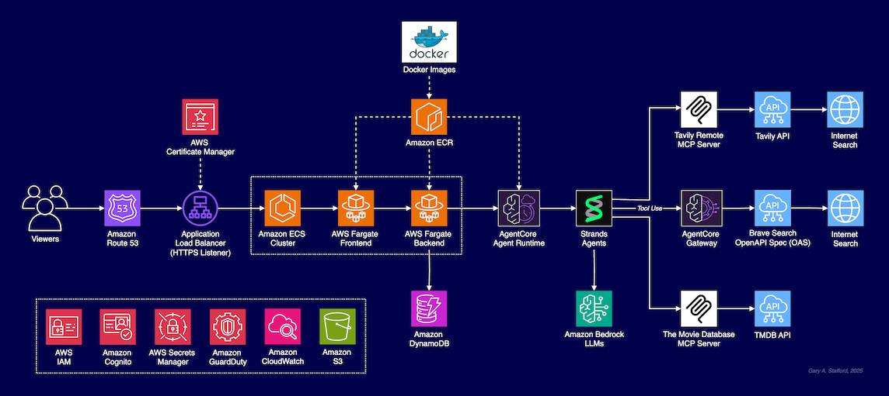
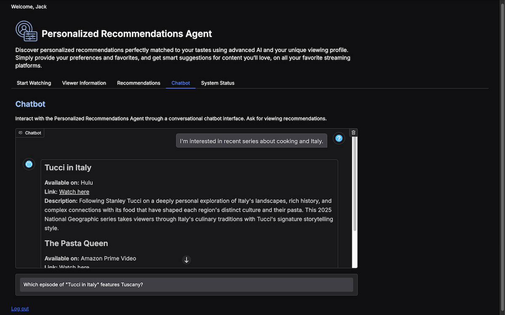
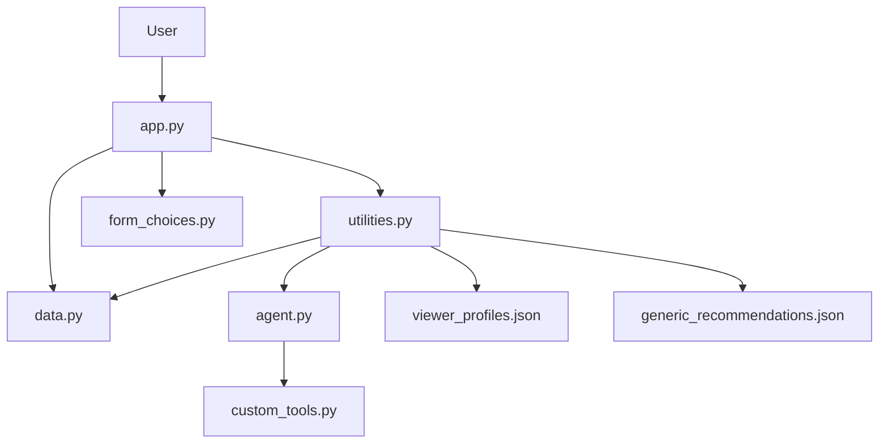

# Personalized Recommendation Agent

This repository contains an implementation of the Personalized Recommendation Agent using the Strands Agent framework and Amazon Bedrock for LLMs. The agent is designed to provide recommendations based on user input and structured data. The entire project is designed to run in a single container, either locally using Docker or optionally, on AWS with Amazon ECS.

**Note**: To simplify deployment for demonstrations, this version of the Personalized Recommendation Agent does **NOT** use Amazon Bedrock AgentCore as shown in the AWS LA Summit talk. It accesses the two third-party APIs directly through `@tool` calls in `custom_tools.py`. Also, this version does not use Amazon DynamoDB to store the user profiles; instead, they are written to a local JSON file, `viewer_profiles.json`.





## Video Demonstration

A video demonstration of the latest Personalized Recommendation Agent, without audio, is available for viewing on [WorkDocs](https://amazon.awsapps.com/workdocs-amazon/index.html#/document/9cb1511aaea86803e6b5241308eebf4a75c4e1b1c61356977143182977873338).

## File Relationships



## Usage Instructions

### 1. API Prerequisites

- Tavily API Key
- Serper.dev API Key

### 2. Local System Prerequisites

- Python 3.12+
- AWS credentials available on the command line
- AWS CLI version 2
- Docker

### 3. Optional AWS Prerequisites

- Amazon ECR Repository
- Amazon ECS Cluster
- Amazon ECS Service
- Amazon ECS Task Execution IAM Role

### 4. Create Local Python Environment (Mac)

Create your local Python virtual environment and install required packages:

Mac with `pip`:

```bash
python -m pip install virtualenv -Uq --break-system-packages
python -m venv .venv
source .venv/bin/activate

python -m pip install pip -Uq
python -m pip install -r requirements.txt -Uq

# For Numpy error first time installing packages
deactivate
source .venv/bin/activate
```

Mac with `uv` ([reference](https://docs.astral.sh/uv/pip/environments/#creating-a-virtual-environment)):

```bash
python -m pip install uv --break-system-packages
uv venv
source .venv/bin/activate

uv pip install -r requirements.txt -Uq
```

### 5. Secrets Manager

To set up the necessary secrets in AWS Secrets Manager, run the following command in your terminal, replacing the placeholder values with your actual API keys and credentials:

```bash
aws secretsmanager create-secret \
  --name PersonalizedRecommendationAgent \
  --description "Required API keys for the Personalized Recommendation Agent" \
  --secret-string '{
    "serper_api_key": "<YOUR_VALUE>",
    "tavily_api_key": "<YOUR_VALUE>"
}'
```

**IMPORTANT**: If using Amazon ECS, your Amazon Amazon ECS Task Execution IAM Role will need permissions to access the secret, for example:

```json
{
  "Version": "2012-10-17",
  "Statement": [
    {
      "Sid": "Statement1",
      "Effect": "Allow",
      "Action": [
        "secretsmanager:GetSecretValue",
        "secretsmanager:DescribeSecret"
      ],
      "Resource": [
        "arn:aws:secretsmanager:us-east-1:<YOUR_ACCOUNT_ID>:secret:PersonalizedRecommendationAgent-*"
      ]
    }
  ]
}
```

### Optional: Build and Push Image to Amazon ECR(Mac)

Use the following commands to build and push the Docker Image to your Amazon ECR repository. Update the `ECR` value to match your Amazon ECR URL.

```bash
ECR=<YOUR_AWS_ACCOUNT_ID>.dkr.ecr.us-east-1.amazonaws.com

# log into ECR
PASSWORD=$(aws ecr get-login-password)
docker login --username AWS --password $PASSWORD $ECR

# build and push image (note linux/amd64 version of image required for ECS!)
REPOSITORY=personalization-agent
TAG=1.0.0
docker buildx build --platform linux/amd64 -t $ECR/$REPOSITORY:$TAG .
docker push $ECR/$REPOSITORY:$TAG
```

### Optional: Run Docker Swarm Locally(Mac)

You can run the container locally using Docker Swarm with the following commands. The `docker-compose.yml` file assumes you have placed your AWS credentials available on the command line:

```text
export AWS_ACCESS_KEY_ID="<YOUR_VALUE>"
export AWS_SECRET_ACCESS_KEY="<YOUR_VALUE>"
export AWS_SESSION_TOKEN="<YOUR_VALUE>"
```

Then, update the `docker-compose.yml` with your image location:

```text
  personalization-agent:
    image: <YOUR_ECR_URL>/<YOUR_ECR_REPO>:<YOUR_IMAGE_TAG>
```

Then, run the Docker Swarm commands:

```bash
docker swarm init

SWARM_ID=$(docker node ls --format "{{.ID}}")
docker stack deploy -c docker-compose.yml $SWARM_ID

docker service ls
```

### Optional 8: Change Agent Configuration

You can change the LLM used by the agent and whether tool consent is granted by changing the environment variable values in the `Dockerfile`:

```text
ENV MODEL_ID=us.anthropic.claude-3-7-sonnet-20250219-v1:0
ENV MODEL_TEMPERATURE=0.2
ENV BYPASS_TOOL_CONSENT=True
```

### 6. Access the Application

1. Once the container is running locally with Docker, you can access the application by navigating to `http://localhost:7860` in your web browser.

2. If using with Amazon ECS, obtain the IP address from your ECS Cluster.

3. To run the application locally, directly form your terminal or IDE, for testing, use `gradio app.py` or `python app.py`, then navigate to `http://localhost:7860` in your web browser. You must set your AWS credentials on the command line in advance if running locally.

### 8. Credentials

You can retrieve a username and password the `viewer_profiles.json` file or just start with `jacksmith` and `jacksmith123!`.
